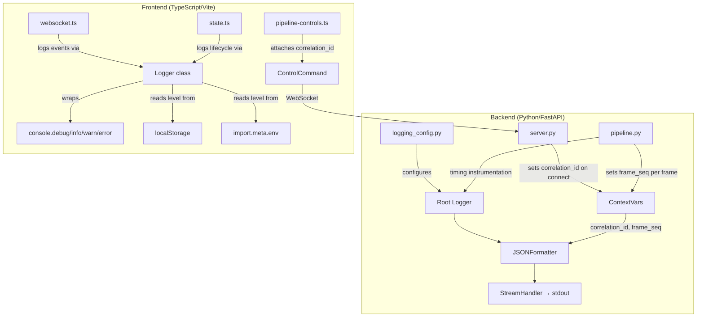

# Design Document: Logging Improvements

## Overview

This design introduces a structured, centralized logging system for both the Python/FastAPI backend and TypeScript/Vite frontend of the Starship Telemetry Web View application. The system provides:

- **Backend**: A JSON-structured logging configuration using Python's standard `logging` module with a custom JSON formatter, contextvars-based correlation ID propagation, and performance timing instrumentation in the pipeline orchestrator.
- **Frontend**: A leveled logging utility class that wraps `console.*` methods with timestamp/module prefixing, configurable severity filtering, and correlation ID attachment for command tracing.

The design prioritizes zero-dependency additions (using stdlib/platform APIs), minimal intrusion into existing code, and structured output that enables log aggregation and filtering.

## Architecture



## Components and Interfaces

### Backend Components

#### 1. `src/logging_config.py` — Centralized Logging Configuration

```python
def configure_logging() -> None:
    """Configure the root logger with JSON formatting and level from environment."""
    ...
```

Responsibilities:
- Read `LOG_LEVEL` from environment (default: `INFO`, fallback on invalid)
- Install a `JSONFormatter` on a `StreamHandler` writing to `stdout`
- Attach the handler to the root logger
- Remove any pre-existing handlers on root to avoid duplicate output

#### 2. `src/logging_config.py` — JSONFormatter

```python
class JSONFormatter(logging.Formatter):
    """Formats log records as single-line JSON objects."""
    
    def format(self, record: logging.LogRecord) -> str:
        """Produce a JSON string with required and contextual fields."""
        ...
```

Output schema per line:
```json
{
  "timestamp": "2024-01-15T10:30:00.123456+00:00",
  "level": "INFO",
  "logger_name": "src.pipeline",
  "module": "src.pipeline",
  "message": "Pipeline started",
  "correlation_id": "550e8400-e29b-41d4-a716-446655440000",
  "frame_seq": 42,
  "exc_type": "ValueError",
  "exc_traceback": "Traceback (most recent call last):\n..."
}
```

Fields `correlation_id`, `frame_seq`, `exc_type`, `exc_traceback` are only included when present/applicable.

#### 3. `src/logging_context.py` — Context Variables

```python
import contextvars

correlation_id_var: contextvars.ContextVar[str | None] = contextvars.ContextVar(
    'correlation_id', default=None
)
frame_seq_var: contextvars.ContextVar[int | None] = contextvars.ContextVar(
    'frame_seq', default=None
)
```

Provides task-local storage for correlation ID and frame sequence number. `asyncio` tasks inherit context from their parent, so pipeline frames spawned from a WebSocket handler automatically carry the session's correlation ID.

#### 4. Modifications to `src/server.py` — Correlation ID Lifecycle

- On WebSocket connect: generate UUID v4, store in `correlation_id_var`, log session start
- On control command: check for client-provided `correlation_id` in payload, validate as UUID v4, replace or reject
- On disconnect: log session correlation_id and connection duration

#### 5. Modifications to `src/pipeline.py` — Performance Logging

- Wrap `_run_ocr_extraction` and `_run_engine_analysis` with timing and log duration at DEBUG
- Log total frame processing time at DEBUG after `_process_frame_parallel` completes
- Track FPS changes and log at INFO when delta exceeds 10%
- Set `frame_seq_var` before processing each frame

### Frontend Components

#### 6. `src/logger.ts` — Frontend Logger Utility

```typescript
export type LogLevel = 'DEBUG' | 'INFO' | 'WARN' | 'ERROR';

export class Logger {
  constructor(private module: string) {}
  
  debug(message: string, context?: Record<string, unknown>): void;
  info(message: string, context?: Record<string, unknown>): void;
  warn(message: string, context?: Record<string, unknown>): void;
  error(message: string, context?: Record<string, unknown>): void;
}

export function createLogger(module: string): Logger;
export function setLogLevel(level: string): void;
export function getLogLevel(): LogLevel;
```

Responsibilities:
- Read initial level: `localStorage.getItem('LOG_LEVEL')` → `import.meta.env.VITE_LOG_LEVEL` → default `WARN`
- Expose `window.__setLogLevel(level: string)` for runtime changes
- Format: `[ISO8601] [LEVEL] [module] message`
- Suppress messages below configured threshold

#### 7. `src/correlation.ts` — Correlation ID Generation

```typescript
export function generateCorrelationId(): string;
```

- Uses `crypto.randomUUID()` when available
- Falls back to timestamp-based ID (`ts-{Date.now()}-{random4hex}`) if unavailable
- Logs fallback usage at WARN level

#### 8. Modifications to `src/websocket.ts` — WebSocket Event Logging

- Log connection state transitions at INFO
- Log parsed message types at DEBUG
- Log parse errors (first 200 chars) at WARN
- Log invalid structure messages at WARN
- Log reconnection attempts at WARN
- Log command send failures (not connected) at WARN

#### 9. Modifications to `src/pipeline-controls.ts` — Correlation ID Attachment

- Generate correlation_id before sending each command
- Include `correlation_id` field in the command payload

#### 10. Modifications to `src/state.ts` — Lifecycle Logging

- Log pipeline status changes at INFO
- Log telemetry record sequence_number at DEBUG
- Log component initialization at DEBUG

## Data Models

### Backend Structured Log Entry

| Field | Type | Presence | Description |
|-------|------|----------|-------------|
| `timestamp` | string | Always | ISO 8601 UTC with timezone designator |
| `level` | string | Always | DEBUG, INFO, WARNING, ERROR, CRITICAL |
| `logger_name` | string | Always | Python logger name (e.g., `src.pipeline`) |
| `module` | string | Always | Same as logger_name |
| `message` | string | Always | Human-readable log message |
| `correlation_id` | string | Conditional | UUID v4, present when in WebSocket session context |
| `frame_seq` | integer | Conditional | Frame sequence number, present during frame processing |
| `exc_type` | string | Conditional | Exception class name, present when logging exceptions |
| `exc_traceback` | string | Conditional | Full traceback string, present when logging exceptions |
| `duration_ms` | integer | Conditional | Operation duration, present in performance logs |
| `fps` | float | Conditional | Processing FPS, present in FPS change logs |

### Frontend Log Output Format

```
[2024-01-15T10:30:00.123Z] [INFO] [websocket] Connection state: disconnected → connected
```

When correlation_id is active:
```
[2024-01-15T10:30:00.123Z] [DEBUG] [pipeline-controls] Sending command: start [cid:550e8400-e29b-41d4-a716-446655440000]
```

### Extended ControlCommand Type

```typescript
export type ControlCommand =
  | { action: 'start'; source_url: string; skip_frames?: number; correlation_id?: string }
  | { action: 'stop'; correlation_id?: string }
  | { action: 'validate_url'; url: string; correlation_id?: string }
  | { action: 'set_interval'; skip_frames: number; correlation_id?: string };
```

## Correctness Properties

*A property is a characteristic or behavior that should hold true across all valid executions of a system — essentially, a formal statement about what the system should do. Properties serve as the bridge between human-readable specifications and machine-verifiable correctness guarantees.*

### Property 1: Structured log output is valid single-line JSON with required fields

*For any* log message string and any log level, when the JSONFormatter formats a LogRecord, the output SHALL be a valid JSON object on a single line (no embedded newlines) containing at minimum the fields: `timestamp` (valid ISO 8601 UTC), `level`, `logger_name`, and `message`.

**Validates: Requirements 1.3, 1.6**

### Property 2: Log level configuration respects valid values and rejects invalid ones

*For any* string value of LOG_LEVEL, if it matches one of (DEBUG, INFO, WARNING, ERROR, CRITICAL) case-insensitively, the root logger SHALL be configured to that level. If the value does not match any valid level, the root logger SHALL be configured to INFO and a WARNING-level entry SHALL be emitted.

**Validates: Requirements 1.4, 1.7**

### Property 3: Contextual fields appear in log output only when set

*For any* combination of correlation_id (string or None) and frame_seq (int or None) in context variables, the formatted JSON log entry SHALL include `correlation_id` if and only if it is not None, and SHALL include `frame_seq` if and only if it is not None.

**Validates: Requirements 2.1, 2.2, 2.5**

### Property 4: Exception logging includes type and traceback

*For any* exception logged via `logger.exception()` or `logger.error(..., exc_info=True)`, the formatted JSON output SHALL include `exc_type` as a non-empty string naming the exception class and `exc_traceback` as a non-empty string containing the traceback.

**Validates: Requirements 2.4**

### Property 5: FPS logging triggers on >10% change

*For any* sequence of FPS values reported to the logging system, an INFO log entry SHALL be emitted for the first value and subsequently only when the new value differs from the previously logged value by more than 10 percent.

**Validates: Requirements 3.4**

### Property 6: Correlation ID validation accepts valid UUID v4 and rejects others

*For any* string provided as a client correlation_id, if it is a valid UUID v4 in lowercase hyphenated format, the system SHALL adopt it for subsequent log entries. If it is not valid, the system SHALL retain the server-generated correlation_id and emit a WARNING.

**Validates: Requirements 4.4, 4.5**

### Property 7: Frontend log level filtering suppresses lower-severity messages

*For any* configured log level L and any message level M, the Frontend_Logger SHALL produce console output if and only if the severity of M is greater than or equal to L, according to the ordering DEBUG < INFO < WARN < ERROR.

**Validates: Requirements 5.3**

### Property 8: Frontend log level resolution follows priority order

*For any* combination of localStorage value, build-time env value, and absence thereof, the Frontend_Logger SHALL use the first valid value found in priority order (localStorage → env → default WARN). Invalid values in higher-priority sources do not block lower-priority valid sources.

**Validates: Requirements 5.4, 5.5**

### Property 9: Invalid frontend log level change is rejected

*For any* string that is not one of "DEBUG", "INFO", "WARN", "ERROR" (case-insensitive), calling `window.__setLogLevel` SHALL not change the current effective log level and SHALL produce a warning message.

**Validates: Requirements 5.7**

### Property 10: WebSocket message parse failure logs truncated raw content

*For any* string that cannot be parsed as valid JSON, the Frontend_Logger SHALL emit a WARN entry containing a parse error description and at most the first 200 characters of the raw string.

**Validates: Requirements 6.4**

### Property 11: Generated correlation IDs are unique UUID v4

*For any* sequence of correlation IDs generated by the frontend, each SHALL be a valid UUID v4 in RFC 4122 lowercase hyphenated format, and all values in the sequence SHALL be distinct.

**Validates: Requirements 7.1, 7.2, 7.4**

### Property 12: Pipeline status transitions are logged with both states

*For any* pipeline status transition from state A to state B (where A ≠ B), the Frontend_Logger SHALL emit an INFO entry containing both the previous status A and the new status B.

**Validates: Requirements 8.2**

## Error Handling

### Backend

| Scenario | Handling |
|----------|----------|
| `LOG_LEVEL` env var invalid | Fall back to INFO, emit WARNING log |
| `JSONFormatter` encounters non-serializable extra field | Convert to string representation, never crash |
| `correlation_id_var` not set in context | Omit field from JSON output (no error) |
| Exception during log formatting | Fall back to `logging.Formatter` default output to avoid silent swallowing |
| Client sends invalid UUID as correlation_id | Reject, keep server ID, log WARNING |
| `configure_logging()` called multiple times | Idempotent — clears existing handlers before reconfiguring |

### Frontend

| Scenario | Handling |
|----------|----------|
| `localStorage` throws (private browsing) | Catch, skip, fall through to env var |
| `crypto.randomUUID()` unavailable | Fall back to timestamp-based ID, log WARN |
| `window.__setLogLevel` called with invalid value | Ignore, retain current level, log warning via current logger |
| Logger module name exceeds 64 characters | Truncate to 64 characters |
| Console methods not available (e.g., SSR) | No-op silently |

## Testing Strategy

### Backend Testing

**Framework**: pytest + hypothesis (already in dev dependencies)

**Unit Tests (pytest)**:
- `JSONFormatter` produces valid JSON for various record types
- `configure_logging()` sets correct level from environment
- Context variables propagate correctly through async tasks
- Exception formatting includes exc_type and exc_traceback
- Performance logging decorators/wrappers measure duration accurately (with mocked time)

**Property-Based Tests (hypothesis)**:
- Minimum 100 iterations per property
- Tag format: `Feature: logging-improvements, Property {N}: {title}`
- Library: `hypothesis` (already installed)

Properties to implement:
1. Structured log output validity (Property 1)
2. Log level configuration (Property 2)
3. Contextual field presence/absence (Property 3)
4. Exception field inclusion (Property 4)
5. FPS change threshold detection (Property 5)
6. UUID validation logic (Property 6)

**Integration Tests**:
- WebSocket session creates and propagates correlation_id
- Pipeline timing logs appear with correct fields
- Full request lifecycle carries correlation_id through all log entries

### Frontend Testing

**Framework**: vitest + fast-check (already in dev dependencies)

**Unit Tests (vitest)**:
- Logger methods output correct format
- Level filtering works as expected
- `createLogger` validates module name
- Correlation ID generation produces valid UUIDs
- Fallback ID generation when crypto unavailable

**Property-Based Tests (fast-check)**:
- Minimum 100 iterations per property
- Tag format: `Feature: logging-improvements, Property {N}: {title}`
- Library: `fast-check` (already installed)

Properties to implement:
7. Log level filtering (Property 7)
8. Level resolution priority (Property 8)
9. Invalid level rejection (Property 9)
10. Parse failure truncation (Property 10)
11. UUID uniqueness and format (Property 11)
12. Status transition logging (Property 12)

**Integration Tests**:
- WebSocket module logs state transitions on connect/disconnect
- Command send attaches correlation_id
- State manager logs lifecycle events
