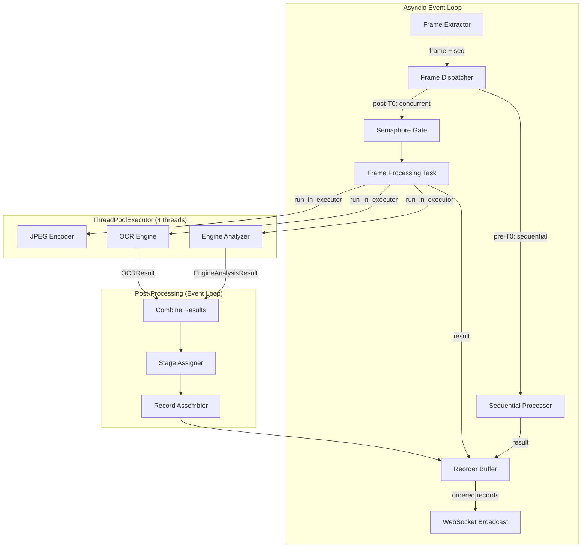

# Design Document: Pipeline Parallelization

## Overview

This design introduces parallelism into the `PipelineOrchestrator` at two levels:

1. **Intra-frame parallelism**: Engine analysis and OCR extraction run concurrently within a single frame using `asyncio.gather` with tasks dispatched to a `ThreadPoolExecutor`.
2. **Inter-frame parallelism**: Multiple frames are processed concurrently through the pipeline, with an asyncio semaphore controlling the concurrency limit and a reorder buffer ensuring output ordering matches capture order.

The architecture preserves the existing asyncio-based server design (WebSocket broadcast, frame capture, HTTP serving) by offloading all CPU-bound work (OpenCV, PyTorch, JPEG encoding) to a thread pool via `loop.run_in_executor`. A T-0 detection gate ensures sequential processing until liftoff is confirmed, after which inter-frame parallelism is enabled.

### Key Design Decisions

1. **ThreadPoolExecutor over ProcessPoolExecutor**: PyTorch models cannot be easily pickled across processes, and `EasyOCREngine` holds mutable state (`_t_zero_detected`). Thread-based parallelism avoids serialization overhead and allows shared-memory access to the model.

2. **Asyncio semaphore for concurrency limiting**: Rather than a custom queue, an `asyncio.BoundedSemaphore` naturally integrates with the existing event loop and provides backpressure without blocking.

3. **Reorder buffer with sequence-based draining**: A `dict[int, TelemetryRecord]` keyed by frame sequence number, with a simple `next_expected` pointer that drains consecutive entries. This is simpler and more cache-friendly than a heap-based approach.

4. **Thread-safe T-0 detection via `threading.Lock`**: The OCR engine's `_t_zero_detected` flag is protected by a lock to ensure exactly-once state transition under concurrent access from multiple thread pool workers.

5. **Frame discard over backpressure**: When concurrency limit is reached, new frames are discarded rather than queued. For live telemetry, stale frames have diminishing value and queuing would introduce unbounded latency.

## Architecture



### Processing Flow

1. **Frame Arrival**: `FrameExtractor` delivers a frame via `_on_frame(frame, seq)`.
2. **Dispatch Decision**: If T-0 not yet detected, frame goes to sequential processing. If T-0 detected and semaphore has capacity, an async task is spawned. If at capacity, frame is discarded.
3. **Parallel Stage Execution**: Within each frame task, engine analysis and OCR run concurrently via `asyncio.gather` with both dispatched to the thread pool.
4. **Result Assembly**: On the event loop, stage assignment and record assembly occur (lightweight, no CPU-bound work).
5. **Reorder & Broadcast**: Completed records enter the reorder buffer. The buffer drains consecutive results in sequence order via WebSocket broadcast.

## Components and Interfaces

### Modified: `PipelineOrchestrator`

The orchestrator gains several new responsibilities and internal state:

```python
class PipelineOrchestrator:
    """Enhanced orchestrator with parallel frame processing."""
    
    def __init__(self, ...):
        # Existing fields preserved...
        
        # NEW: Thread pool for CPU-bound work
        self._executor: ThreadPoolExecutor | None = None
        self._executor_max_workers: int = 4  # configurable 1-8
        
        # NEW: Inter-frame concurrency control
        self._concurrency_limit: int = 3  # configurable 1-10
        self._semaphore: asyncio.BoundedSemaphore | None = None
        self._in_flight_count: int = 0
        
        # NEW: Reorder buffer
        self._reorder_buffer: dict[int, TelemetryRecord] = {}
        self._next_expected_seq: int = 1
        self._broadcast_sequence: int = 0  # monotonic broadcast counter
        self._max_buffer_size: int = 120
        
        # NEW: T-0 gate state
        self._t_zero_detected: bool = False
        self._frame_sequence_counter: int = 0
        
        # NEW: FPS measurement (sliding window of broadcast timestamps)
        self._broadcast_timestamps: deque[float] = deque(maxlen=10)
    
    async def start(self, source_url: str, skip_frames: int = 30) -> None:
        """Start pipeline, creating executor and semaphore."""
        ...
        self._executor = ThreadPoolExecutor(max_workers=self._executor_max_workers)
        self._semaphore = asyncio.BoundedSemaphore(self._concurrency_limit)
        ...
    
    def stop(self) -> None:
        """Stop pipeline, shutting down executor with timeout."""
        ...
        self._executor.shutdown(wait=True, cancel_futures=True)
        ...
    
    async def _on_frame(self, frame: np.ndarray, seq: int) -> None:
        """Dispatch frame for processing based on T-0 state."""
        ...
    
    async def _process_frame_sequential(self, frame: np.ndarray, seq: int) -> None:
        """Process a single frame sequentially (pre-T-0)."""
        ...
    
    async def _process_frame_parallel(self, frame: np.ndarray, seq: int) -> None:
        """Process a frame with intra-frame parallelism."""
        ...
    
    async def _run_engine_analysis(self, frame: np.ndarray) -> EngineAnalysisResult:
        """Execute engine analysis in thread pool with timeout."""
        ...
    
    async def _run_ocr_extraction(self, frame: np.ndarray) -> OCRResult:
        """Execute OCR extraction in thread pool with timeout."""
        ...
    
    async def _run_jpeg_encoding(self, frame: np.ndarray) -> str:
        """Execute JPEG encoding in thread pool."""
        ...
    
    async def _submit_to_reorder_buffer(self, seq: int, record: TelemetryRecord) -> None:
        """Add a completed record to the reorder buffer and drain if possible."""
        ...
    
    async def _drain_reorder_buffer(self) -> None:
        """Broadcast consecutive records from the buffer."""
        ...
    
    async def _handle_stale_gap(self) -> None:
        """Discard stalled gaps older than 5 seconds."""
        ...
```

### Modified: `EasyOCREngine`

Thread-safety additions for concurrent access:

```python
class EasyOCREngine:
    """Thread-safe OCR engine with protected T-0 state transition."""
    
    def __init__(self, gpu_capabilities: GPUCapabilities) -> None:
        ...
        self._t_zero_lock = threading.Lock()  # NEW: protects _t_zero_detected
    
    def extract_text(self, frame, text_regions) -> OCRResult:
        """Thread-safe extract_text with atomic T-0 detection."""
        # Use lock around T-0 state check and transition
        with self._t_zero_lock:
            t_zero_was_detected = self._t_zero_detected
        
        # ... perform OCR ...
        
        # If T-0 detected in this call, atomically transition
        if not t_zero_was_detected and detected_t_zero_now:
            with self._t_zero_lock:
                if not self._t_zero_detected:  # double-check
                    self._t_zero_detected = True
```

### New: `ReorderBuffer`

Extracted as a focused class for testability:

```python
@dataclass
class BufferedResult:
    """A frame result waiting in the reorder buffer."""
    record: TelemetryRecord
    frame_b64: str | None
    inserted_at: float  # time.monotonic() when buffered

class ReorderBuffer:
    """Manages out-of-order result buffering and sequential draining."""
    
    def __init__(self, max_size: int = 120):
        self._buffer: dict[int, BufferedResult] = {}
        self._next_expected: int = 1
        self._max_size: int = max_size
    
    def insert(self, seq: int, result: BufferedResult) -> None:
        """Insert a completed result into the buffer."""
        ...
    
    def drain(self) -> list[BufferedResult]:
        """Return all consecutively available results starting from next_expected."""
        ...
    
    def advance_past_gap(self, gap_seq: int) -> None:
        """Skip a stalled frame, advancing next_expected past it."""
        ...
    
    def discard_oldest_gap(self) -> int:
        """Remove the oldest pending gap to free buffer space. Returns discarded seq."""
        ...
    
    @property
    def size(self) -> int:
        """Current number of buffered results."""
        ...
    
    @property
    def next_expected(self) -> int:
        """The next sequence number expected for broadcast."""
        ...
```

### New: `ConcurrencyController`

Encapsulates the semaphore and in-flight tracking:

```python
class ConcurrencyController:
    """Controls inter-frame concurrency with frame discard semantics."""
    
    def __init__(self, limit: int = 3):
        self._limit: int = limit
        self._in_flight: int = 0
        self._semaphore = asyncio.BoundedSemaphore(limit)
    
    def try_acquire(self) -> bool:
        """Non-blocking attempt to acquire a processing slot.
        Returns True if acquired, False if at capacity (frame should be discarded).
        """
        ...
    
    def release(self) -> None:
        """Release a processing slot after frame completion."""
        ...
    
    @property
    def in_flight(self) -> int:
        """Number of frames currently being processed."""
        ...
    
    @property
    def limit(self) -> int:
        """Current concurrency limit."""
        ...
    
    def set_limit(self, new_limit: int) -> bool:
        """Update the limit. Returns False if out of range [1, 10]."""
        ...
```

### Unchanged Components

- **`FrameExtractor`**: No changes needed. Already uses async callbacks and provides sequence numbers.
- **`StageAssigner`**: Lightweight, runs on event loop after parallel stages complete. No thread-safety concern since it's called sequentially per-frame within a task.
- **`RecordAssembler`**: Modified minimally — sequence numbers are now assigned at broadcast time (by the reorder buffer drain logic) rather than at assembly time. The assembler still produces records, but the `sequence_number` field is overwritten during broadcast ordering.

## Data Models

### New: `ParallelPipelineConfig`

```python
@dataclass
class ParallelPipelineConfig:
    """Configuration for the parallelized pipeline."""
    
    executor_max_workers: int = 4      # Thread pool size [1-8]
    concurrency_limit: int = 3         # Max concurrent frames [1-10]
    stage_timeout_seconds: float = 30.0  # Timeout for individual stages
    frame_timeout_seconds: float = 10.0  # Timeout for complete frame processing
    max_buffer_size: int = 120          # Maximum reorder buffer entries
    stale_gap_timeout_seconds: float = 5.0  # Time before advancing past a gap
    shutdown_timeout_seconds: float = 10.0  # Max wait for executor shutdown
    buffer_overflow_threshold: float = 2.0  # Buffer size / concurrency_limit triggers trim

    def validate(self) -> list[str]:
        """Validate configuration values. Returns list of error messages."""
        errors = []
        if not (1 <= self.executor_max_workers <= 8):
            errors.append("executor_max_workers must be between 1 and 8")
        if not (1 <= self.concurrency_limit <= 10):
            errors.append("concurrency_limit must be between 1 and 10")
        if self.stage_timeout_seconds <= 0:
            errors.append("stage_timeout_seconds must be positive")
        if self.frame_timeout_seconds <= 0:
            errors.append("frame_timeout_seconds must be positive")
        return errors
```

### Modified: `PipelineState`

```python
@dataclass
class PipelineState:
    """Tracks the current state of the extraction pipeline."""
    
    # Existing fields...
    status: PipelineStatus = PipelineStatus.STOPPED
    source_url: str | None = None
    source_validated: bool = False
    skip_frames: int = 30
    current_sequence: int = 0
    separation_state: SeparationState = SeparationState.PRE_SEPARATION
    active_template_name: str = "starship_rois"
    gpu_capabilities: GPUCapabilities | None = None
    processing_fps: float = 0.0
    
    # NEW fields
    in_flight_frames: int = 0           # Current concurrent frame count
    t_zero_detected: bool = False       # Whether T-0 has been detected
    parallel_mode_active: bool = False  # Whether inter-frame parallelism is enabled
    frames_discarded: int = 0           # Count of frames discarded due to capacity
    buffer_size: int = 0                # Current reorder buffer occupancy
```

### Modified: Status Payload

The WebSocket status broadcast gains new fields:

```python
def build_status_payload(self) -> dict[str, Any]:
    return {
        "status": self._state.status.value,
        "gpu": {
            "available": self._gpu_capabilities.gpu_available,
            "device_name": self._gpu_capabilities.device_name,
        },
        "skip_frames": self._state.skip_frames,
        "current_sequence": self._state.current_sequence,
        "processing_fps": self._state.processing_fps,
        # NEW fields
        "in_flight_frames": self._state.in_flight_frames,
        "parallel_mode_active": self._state.parallel_mode_active,
        "frames_discarded": self._state.frames_discarded,
    }
```

### FPS Measurement Model

```python
@dataclass
class FPSMeter:
    """Sliding-window FPS measurement based on broadcast timestamps."""
    
    _timestamps: deque[float] = field(default_factory=lambda: deque(maxlen=10))
    
    def record_broadcast(self, timestamp: float) -> None:
        """Record a broadcast event timestamp."""
        self._timestamps.append(timestamp)
    
    def get_fps(self) -> float:
        """Compute FPS from sliding window of last 10 broadcasts.
        Returns 0.0 if fewer than 2 broadcasts recorded.
        """
        if len(self._timestamps) < 2:
            return 0.0
        elapsed = self._timestamps[-1] - self._timestamps[0]
        if elapsed <= 0:
            return 0.0
        return round((len(self._timestamps) - 1) / elapsed, 2)
```


## Correctness Properties

*A property is a characteristic or behavior that should hold true across all valid executions of a system—essentially, a formal statement about what the system should do. Properties serve as the bridge between human-readable specifications and machine-verifiable correctness guarantees.*

### Property 1: Fault Isolation Between Parallel Stages

*For any* valid frame processing where one of the two parallel stages (Engine Analyzer or OCR Engine) raises an exception, the pipeline SHALL produce a default result for the failed stage while preserving the successful stage's result unchanged in the final assembled record.

**Validates: Requirements 1.3, 1.4**

### Property 2: Configuration Parameter Validation

*For any* integer value provided as `executor_max_workers`, the system SHALL accept it if and only if it is in the range [1, 8]. *For any* integer value provided as `concurrency_limit`, the system SHALL accept it if and only if it is in the range [1, 10]. Values outside these ranges SHALL be rejected and the previous configuration SHALL be retained.

**Validates: Requirements 2.3, 3.3, 3.5, 7.3**

### Property 3: Exception Resilience in Thread Pool

*For any* exception raised by a CPU-bound task (Engine Analyzer, OCR Engine, or JPEG encoding) executing in the ThreadPoolExecutor, the exception SHALL propagate to the calling asyncio coroutine and be logged, and the pipeline SHALL continue processing subsequent frames without crashing.

**Validates: Requirements 2.5, 7.5**

### Property 4: Admission Control Invariant

*For any* pipeline state, when a new frame arrives: if the number of in-flight frames is strictly less than the concurrency limit, the frame SHALL be dispatched for processing; if the number of in-flight frames equals the concurrency limit, the frame SHALL be discarded and a warning logged with the frame's sequence number.

**Validates: Requirements 3.1, 3.2**

### Property 5: In-Flight Count Conservation

*For any* sequence of frame dispatch and completion events, the in-flight frame count SHALL equal the number of dispatched frames minus the number of completed (or cancelled) frames, and SHALL never be negative or exceed the concurrency limit.

**Validates: Requirements 3.4**

### Property 6: Frame Sequence Number Contiguity

*For any* number N of frames dispatched for processing, the assigned Frame_Sequence_Numbers SHALL form the contiguous sequence [1, 2, 3, ..., N] with no gaps or duplicates.

**Validates: Requirements 4.1**

### Property 7: Reorder Buffer Preserves Capture Order

*For any* permutation of frame completion order, the reorder buffer SHALL produce broadcast output in strictly ascending Frame_Sequence_Number order, matching the original capture sequence. The assigned broadcast sequence numbers SHALL be monotonically increasing starting at 1.

**Validates: Requirements 4.2, 4.3, 4.4**

### Property 8: Buffer Overflow Triggers Discard and Drain

*For any* reorder buffer state where the buffer size exceeds the maximum capacity (120 entries) or exceeds 2 times the concurrency limit, the system SHALL repeatedly discard the oldest pending gap and advance the expected sequence number until the buffer is within limits, then drain all consecutively available results.

**Validates: Requirements 4.6, 8.2**

### Property 9: Sequential Processing Before T-0

*For any* sequence of frames arriving before T-0 is detected, the pipeline SHALL process them one at a time in capture-sequence order, with no two frames having overlapping processing timespans.

**Validates: Requirements 5.1**

### Property 10: T-0 Exactly-Once State Transition

*For any* number of concurrent threads invoking `extract_text` simultaneously where T-0 has not yet been detected, the T-0 state transition (from not-detected to detected) SHALL occur exactly once, and all threads completing after the transition SHALL observe the detected state.

**Validates: Requirements 5.3, 5.4**

### Property 11: FPS Sliding Window Calculation

*For any* sequence of broadcast timestamps, the processing FPS SHALL equal `(count - 1) / (last_timestamp - first_timestamp)` over the most recent 10 broadcast events, rounded to 2 decimal places. If fewer than 2 broadcasts have occurred, FPS SHALL be 0.0.

**Validates: Requirements 6.1, 6.4**

### Property 12: Timeout Advances Expected Sequence

*For any* frame whose processing exceeds the configured timeout, the system SHALL cancel the task, advance the expected sequence number past that frame's sequence number, and continue processing subsequent frames without blocking the reorder buffer.

**Validates: Requirements 8.1**

## Error Handling

### Stage-Level Errors (Intra-Frame)

| Error Condition | Handling | Result |
|---|---|---|
| Engine Analyzer exception | Log error, produce default `EngineAnalysisResult` (all UNDETECTED, accuracy 0.0) | Frame continues with OCR result |
| OCR Engine exception | Log error, produce default `OCRResult` (all UNAVAILABLE) | Frame continues with engine result |
| Both stages fail | Log both errors, skip frame entirely | Pipeline continues |
| Stage timeout (30s) | Cancel task via `asyncio.wait_for`, treat as exception | Same as exception case |

### Frame-Level Errors (Inter-Frame)

| Error Condition | Handling | Result |
|---|---|---|
| Frame processing timeout (10s) | Cancel entire frame task, advance sequence past it | Subsequent frames unblocked |
| Reorder buffer overflow (>120) | Discard oldest gap, drain consecutive results | Buffer freed for new entries |
| Buffer >2× concurrency_limit | Repeatedly discard oldest gap until ≤ limit | Prevent unbounded memory growth |
| Stale gap (>5s waiting) | Advance past gap, drain available results | Stream resumes without indefinite stall |

### Lifecycle Errors

| Error Condition | Handling | Result |
|---|---|---|
| Executor shutdown timeout (10s) | Abandon remaining tasks, release executor, log error with count | Pipeline marked stopped |
| Frame discard at capacity | Log warning with frame sequence number | Frame dropped, no downstream impact |
| Invalid config value | Reject change, retain previous value | Pipeline unaffected |

### Error Propagation Strategy

- **Thread pool → Event loop**: Exceptions raised inside `run_in_executor` naturally propagate to the awaiting coroutine. The coroutine catches them, logs, and applies the default-result fallback.
- **Task cancellation**: `asyncio.wait_for` raises `asyncio.TimeoutError` which is caught at the frame-processing level.
- **Unhandled exceptions**: A top-level try/except in each frame processing task ensures no exception escapes to crash the event loop.

## Testing Strategy

### Property-Based Tests (Hypothesis)

The project already uses Hypothesis with a configured `conftest.py` (100 examples default, 500 for CI). Each correctness property maps to a property-based test:

| Property | Test Focus | Generator Strategy |
|---|---|---|
| 1: Fault Isolation | Mock one stage to raise, verify other's result preserved | Random `OCRResult` / `EngineAnalysisResult` instances |
| 2: Config Validation | Generate integers, verify accept/reject boundaries | `st.integers()` across wide range |
| 3: Exception Resilience | Generate exception types, verify pipeline survives | `st.sampled_from([ValueError, RuntimeError, OSError, ...])` |
| 4: Admission Control | Generate in-flight counts and limits | `st.integers(min_value=0, max_value=15)` for state |
| 5: In-Flight Conservation | Generate dispatch/complete event sequences | `st.lists(st.sampled_from(["dispatch", "complete", "cancel"]))` |
| 6: Sequence Contiguity | Generate N frames | `st.integers(min_value=1, max_value=100)` |
| 7: Reorder Ordering | Generate completion permutations | `st.permutations(range(1, N+1))` |
| 8: Buffer Overflow | Generate buffer states at/above capacity | Custom strategy for buffer contents |
| 9: Sequential Pre-T-0 | Generate frame arrival sequences | `st.lists(st.just("frame"), min_size=1, max_size=20)` |
| 10: T-0 Exactly-Once | Generate concurrent thread scenarios | `st.integers(min_value=2, max_value=8)` for thread count |
| 11: FPS Calculation | Generate timestamp sequences | `st.lists(st.floats(min_value=0.01, max_value=100.0))` |
| 12: Timeout Advance | Generate timeout scenarios with buffer state | Combined strategy for buffer + timeout position |

**Configuration**:
- Minimum 100 iterations per property test (default profile)
- Each test tagged: `# Feature: pipeline-parallelization, Property {N}: {title}`
- Tests run with `pytest tests/ --hypothesis-profile=default`

### Unit Tests (Example-Based)

- T-0 detection enables parallel mode (specific scenario)
- Status payload includes `in_flight_frames` field
- Pre-T-0 queued frames skipped after T-0 detection
- Both stages failing skips frame without crash
- Executor created on `start()`, shutdown on `stop()`

### Integration Tests

- Concurrent execution timing (wall-clock overlap verification)
- Stale gap timeout behavior (mocked time)
- Graceful shutdown under load (cancel in-flight tasks)
- Event loop responsiveness during parallel processing
- JPEG encoding dispatched to thread pool

### Test Infrastructure

- **Mocking strategy**: CPU-bound stages mocked with `asyncio.sleep` + return value to simulate timing without actual OpenCV/PyTorch
- **Thread-safety tests**: Use `threading.Barrier` to synchronize concurrent access for T-0 race condition testing
- **Buffer testing**: `ReorderBuffer` tested as a pure data structure with generated permutations — no async needed
- **FPS testing**: `FPSMeter` tested as a pure computation with generated timestamp sequences
