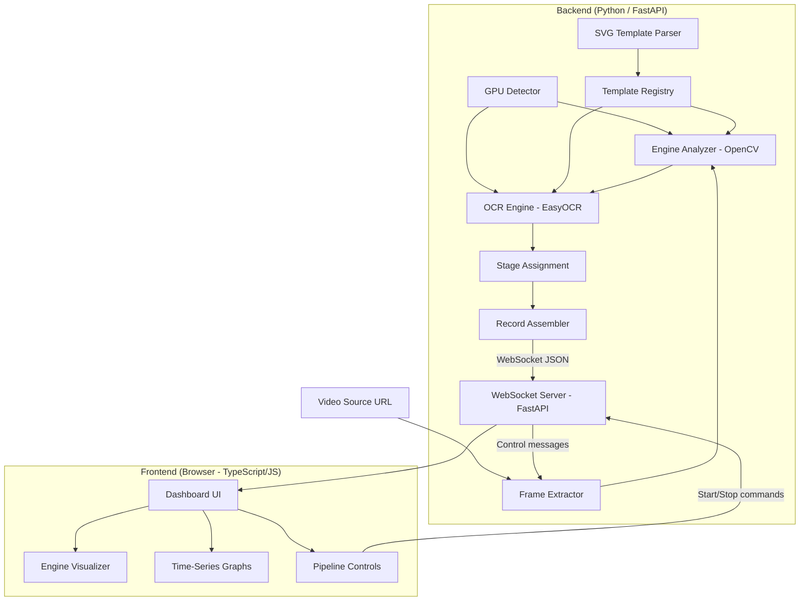

# Design Document: Starship Telemetry Web View

## Overview

This system extracts telemetry data from SpaceX Starship livestream video frames and displays it in a real-time web dashboard. The pipeline operates in stages:

1. **SVG Template Parsing** — Parse ROI template SVGs to determine frame regions for data extraction
2. **Frame Extraction** — Capture frames from a livestream at a configurable rate
3. **Engine Analysis** — Detect engine circle indicators via Hough Circle Detection and classify status by color
4. **OCR Extraction** — Read text values (time, speed, altitude, stage labels) from non-engine ROI regions
5. **Stage Assignment** — Attribute telemetry to the correct vehicle based on separation state
6. **Record Assembly & Serialization** — Package extracted data into structured JSON records
7. **Web Dashboard** — Display telemetry with engine diagrams, time-series graphs, and pipeline controls

The system uses a **Python backend** with **FastAPI** for the WebSocket server, **EasyOCR** (PyTorch-backed) for text recognition with native CUDA/GPU support, and **OpenCV-Python** for image processing. The frontend is a browser-based TypeScript/JavaScript dashboard connected to the backend via WebSocket.

**GPU Strategy:** At startup, the system auto-detects CUDA GPU availability via `torch.cuda.is_available()`. If a CUDA-capable GPU is present, EasyOCR is initialized with `gpu=True` for GPU-accelerated inference. If no GPU is available, EasyOCR falls back transparently to CPU-only mode (`gpu=False`) with no configuration change required from the user.

## Architecture



**Key Architectural Decisions:**

- **WebSocket for real-time updates**: The backend pushes Telemetry_Records to the frontend over a WebSocket connection via FastAPI, meeting the <500ms update requirement.
- **Pipeline ordering**: Engine Analyzer runs before OCR to identify which text regions are occluded by engine indicators, preventing false OCR reads.
- **Session-level state**: Stage separation is tracked as a session flag that transitions once and never reverts, ensuring consistent assignment across frames.
- **Template Registry pattern**: Decouples ROI definitions from processing logic, enabling future multi-template support without code changes.
- **GPU auto-detection**: A `detect_gpu()` function probes for CUDA availability at startup via PyTorch and configures EasyOCR accordingly, providing a single code path with transparent fallback.
- **EasyOCR over Tesseract/PaddleOCR**: EasyOCR is PyTorch-backed with native CUDA/GPU support and CPU fallback. Simpler setup than PaddleOCR, good accuracy on stylized digital text, and direct integration with PyTorch's CUDA management.
- **FastAPI over Flask/Django**: FastAPI provides native async WebSocket support, high performance, and Pydantic model validation out of the box.
- **Hough Circle Detection tuned parameters**: The user has prototyped and validated optimal HCD parameters (`dp=1.0, minDist=7, param1=50, param2=10, minRadius=4, maxRadius=max_r`) for reliable engine detection at 1fps minimum.

## Components and Interfaces

### GPU Detector

**Responsibility:** Probe for CUDA GPU availability at startup and configure acceleration backends for EasyOCR.

**Interface:**
```python
from dataclasses import dataclass
from enum import Enum
import torch


class AccelerationBackend(Enum):
    CPU = "cpu"
    CUDA_GPU = "cuda_gpu"


@dataclass(frozen=True)
class GPUCapabilities:
    backend: AccelerationBackend
    device_name: str | None          # e.g., "NVIDIA RTX 4090"
    cuda_version: str | None         # e.g., "12.2"
    gpu_available: bool              # True if CUDA GPU detected


def detect_gpu() -> GPUCapabilities:
    """
    Detect CUDA GPU availability using torch.cuda.is_available().
    Returns GPUCapabilities with gpu_available=True if CUDA is present,
    otherwise returns CPU fallback configuration.
    """
    gpu_available = torch.cuda.is_available()
    if gpu_available:
        return GPUCapabilities(
            backend=AccelerationBackend.CUDA_GPU,
            device_name=torch.cuda.get_device_name(0),
            cuda_version=torch.version.cuda,
            gpu_available=True,
        )
    return GPUCapabilities(
        backend=AccelerationBackend.CPU,
        device_name=None,
        cuda_version=None,
        gpu_available=False,
    )
```

### SVG Template Parser

**Responsibility:** Parse SVG ROI template files into structured configuration objects.

**Interface:**
```python
from dataclasses import dataclass, field
from typing import Literal


@dataclass(frozen=True)
class ROIRect:
    id: str
    x: float
    y: float
    width: float
    height: float


@dataclass(frozen=True)
class ROICircle:
    id: str
    cx: float
    cy: float
    r: float


@dataclass(frozen=True)
class EngineSubgroup:
    name: str               # e.g., "atmo", "vacuum", "inner", "middle", "outer"
    circles: list[ROICircle]


@dataclass(frozen=True)
class EngineGroup:
    group_id: str            # e.g., "engines_starship", "engines_superheavy"
    bounding_box: ROIRect    # computed from min/max of child circles
    subgroups: list[EngineSubgroup]


@dataclass(frozen=True)
class ROIConfiguration:
    template_name: str
    view_box: tuple[Literal[1920], Literal[1080]]
    text_regions: dict[str, ROIRect]    # time, speed_L, altitude_R, etc.
    engine_groups: list[EngineGroup]


@dataclass
class ParseError:
    message: str
    missing_regions: list[str] = field(default_factory=list)
    malformed_elements: list[str] = field(default_factory=list)


def parse_roi_template(svg_content: str) -> ROIConfiguration | ParseError:
    """Parse an SVG ROI template into a structured configuration."""
    ...


def serialize_roi_configuration(config: ROIConfiguration) -> str:
    """Serialize an ROIConfiguration back to SVG format."""
    ...
```

### Template Registry

**Responsibility:** Store and retrieve ROI templates by name.

**Interface:**
```python
@dataclass
class TemplateNotFoundError:
    template_name: str
    available_templates: list[str]


class TemplateRegistry:
    def register(self, name: str, config: ROIConfiguration) -> None:
        """Register a template under the given name."""
        ...

    def get(self, name: str) -> ROIConfiguration | TemplateNotFoundError:
        """Retrieve a template by name."""
        ...

    def list_templates(self) -> list[str]:
        """List all registered template names."""
        ...

    def get_default(self) -> ROIConfiguration:
        """Return the default template (starship_rois)."""
        ...
```

### Frame Extractor

**Responsibility:** Capture frames from a video source at a configurable interval using OpenCV VideoCapture.

**Interface:**
```python
import numpy as np
from dataclasses import dataclass
from enum import Enum
from typing import Callable, Awaitable


class PipelineStatus(Enum):
    STOPPED = "stopped"
    RUNNING = "running"
    DISCONNECTED = "disconnected"
    RECONNECTING = "reconnecting"


@dataclass
class FrameExtractorConfig:
    source_url: str
    interval_ms: int = 1000         # default: 1 frame per second
    target_width: int = 1920
    target_height: int = 1080


@dataclass
class ConnectionError:
    message: str
    url: str


class FrameExtractor:
    async def validate(self, url: str) -> None | ConnectionError:
        """Check whether the video source is reachable and active."""
        ...

    def start(self, config: FrameExtractorConfig) -> None:
        """Begin frame capture at the configured interval."""
        ...

    def stop(self) -> None:
        """Stop frame capture immediately."""
        ...

    def on_frame(self, callback: Callable[[np.ndarray, int], Awaitable[None]]) -> None:
        """Register a callback for each captured frame (BGR numpy array, sequence number)."""
        ...

    def on_status_change(self, callback: Callable[[PipelineStatus], Awaitable[None]]) -> None:
        """Register a callback for pipeline status transitions."""
        ...
```

### Engine Analyzer

**Responsibility:** Detect engine indicators and classify their status using OpenCV Hough Circle Detection with user-tuned parameters.

**Interface:**
```python
import numpy as np
from dataclasses import dataclass, field
from enum import Enum


class EngineStatus(Enum):
    ACTIVE = "active"
    INACTIVE = "inactive"
    UNDETECTED = "undetected"


@dataclass(frozen=True)
class HoughParams:
    """User-tuned Hough Circle Detection parameters."""
    dp: float = 1.0
    min_dist: int = 7
    param1: int = 50
    param2: int = 10
    min_radius: int = 4
    max_radius: int = 8      # varies by engine type


@dataclass(frozen=True)
class EngineAnalyzerConfig:
    distance_tolerance: float = 5.0         # pixels
    brightness_threshold: float = 128.0     # V channel in HSV
    saturation_threshold: float = 80.0      # S channel in HSV
    hough_starship: HoughParams = field(default_factory=lambda: HoughParams(
        dp=1.0, min_dist=7, param1=50, param2=10, min_radius=4, max_radius=20,
    ))
    hough_superheavy: HoughParams = field(default_factory=lambda: HoughParams(
        dp=1.0, min_dist=7, param1=50, param2=10, min_radius=4, max_radius=12,
    ))


@dataclass
class EngineAnalysisResult:
    engine_statuses: dict[str, EngineStatus]    # keyed by engine id (e.g., "e1")
    detection_accuracy: float                    # matched / total expected
    engine_group_bounding_boxes: list[ROIRect]   # for OCR occlusion check


def analyze_engines(
    frame: np.ndarray,
    engine_groups: list[EngineGroup],
    config: EngineAnalyzerConfig,
    gpu_capabilities: GPUCapabilities,
) -> EngineAnalysisResult:
    """
    Detect and classify engine statuses using OpenCV HoughCircles.

    Algorithm:
    1. Crop frame to engine group bounding box
    2. Convert cropped region to grayscale
    3. Apply HoughCircles with tuned params (dp=1.0, minDist=7, param1=50, param2=10)
    4. Match detected circles to expected SVG positions within distance_tolerance
    5. For matched circles: convert to HSV, sample color inside circle
       - High brightness (V > threshold) AND high saturation (S > threshold) → ACTIVE
       - Low brightness (V <= threshold) → INACTIVE
    6. Unmatched expected positions → UNDETECTED
    """
    ...
```

### OCR Engine

**Responsibility:** Extract text values from frame regions not occluded by engines. Uses EasyOCR with GPU acceleration when available.

**Interface:**
```python
import numpy as np
import easyocr
from dataclasses import dataclass
from enum import Enum


class OCRFieldStatus(Enum):
    AVAILABLE = "available"
    UNAVAILABLE = "unavailable"
    OCCLUDED_BY_ENGINES = "occluded_by_engines"


@dataclass
class OCRFieldResult:
    status: OCRFieldStatus
    raw_text: str | None = None
    parsed_value: float | str | None = None


@dataclass
class OCRResult:
    time: OCRFieldResult
    speed_l: OCRFieldResult       # value
    speed_l_unit: OCRFieldResult  # unit
    speed_r: OCRFieldResult
    speed_r_unit: OCRFieldResult
    altitude_l: OCRFieldResult
    altitude_l_unit: OCRFieldResult
    altitude_r: OCRFieldResult
    altitude_r_unit: OCRFieldResult
    stage_l: OCRFieldResult
    stage_r: OCRFieldResult
    stage_sep_text: OCRFieldResult


class EasyOCREngine:
    """Wraps EasyOCR Reader with GPU/CPU auto-configuration."""

    def __init__(self, gpu_capabilities: GPUCapabilities) -> None:
        """
        Initialize EasyOCR Reader.
        EasyOCR uses PyTorch for inference. gpu parameter is set based on
        CUDA availability detected at startup.

        Args:
            gpu_capabilities: Result of detect_gpu() call
        """
        self.reader = easyocr.Reader(
            lang_list=["en"],
            gpu=gpu_capabilities.gpu_available,  # True if CUDA available, False otherwise
        )

    def extract_text(
        self,
        frame: np.ndarray,
        text_regions: dict[str, ROIRect],
        engine_bounding_boxes: list[ROIRect],
    ) -> OCRResult:
        """
        Extract text from non-occluded ROI regions.

        For each text region:
        1. Check if it intersects any engine bounding box → mark OCCLUDED_BY_ENGINES
        2. Crop frame to ROI rect
        3. Call self.reader.readtext(cropped_image) to get text predictions
        4. Parse result based on field type (float for speed/altitude, time format for time)
        5. If confidence is low or no text detected → mark UNAVAILABLE
        """
        ...
```

### Stage Assignment

**Responsibility:** Attribute telemetry to the correct vehicle.

**Interface:**
```python
from dataclasses import dataclass
from enum import Enum


class SeparationState(Enum):
    PRE_SEPARATION = "pre_separation"
    POST_SEPARATION = "post_separation"


@dataclass
class StageAssignmentResult:
    left_stage: str          # "super_heavy", "starship", or as labeled
    right_stage: str
    separation_state: SeparationState


class StageAssigner:
    def __init__(self) -> None:
        self._separation_state = SeparationState.PRE_SEPARATION

    def assign(self, ocr_result: OCRResult) -> StageAssignmentResult:
        """Determine stage assignment based on OCR result and session state."""
        ...

    def get_separation_state(self) -> SeparationState:
        """Return current separation state."""
        return self._separation_state

    def reset(self) -> None:
        """Reset separation state to pre_separation."""
        self._separation_state = SeparationState.PRE_SEPARATION
```

### Telemetry Record

**Responsibility:** Structured data object for a single frame's telemetry. Uses Pydantic for validation and serialization.

**Interface:**
```python
from pydantic import BaseModel, Field


class TelemetryRecord(BaseModel):
    sequence_number: int
    mission_elapsed_time: str | None            # "T+HH:MM:SS" or "T-HH:MM:SS"
    speed_left: dict                             # {"value": float|None, "unit": str|None, "status": str}
    speed_right: dict
    altitude_left: dict
    altitude_right: dict
    stage_left_label: str | None
    stage_right_label: str | None
    stage_separation_text: str | None
    stage_assignment_left: str
    stage_assignment_right: str
    separation_state: str                        # "pre_separation" | "post_separation"
    starship_engines: dict[str, str]             # 6 entries: engine_id -> status
    superheavy_engines: dict[str, str]           # 33 entries: engine_id -> status
    detection_accuracy: dict[str, float]         # {"starship": float, "superheavy": float}
    timestamp: int                               # Unix ms


class ValidationError(BaseModel):
    message: str
    missing_fields: list[str] = Field(default_factory=list)
    type_errors: list[str] = Field(default_factory=list)


def serialize_telemetry_record(record: TelemetryRecord) -> str:
    """Serialize to JSON string via Pydantic."""
    return record.model_dump_json()


def deserialize_telemetry_record(json_str: str) -> TelemetryRecord | ValidationError:
    """Deserialize JSON to TelemetryRecord, returning ValidationError on failure."""
    ...
```

### WebSocket Server (FastAPI)

**Responsibility:** Serve the web dashboard and manage real-time WebSocket connections.

**Interface:**
```python
from fastapi import FastAPI, WebSocket
from fastapi.staticfiles import StaticFiles

app = FastAPI()

# Serve the frontend static files (HTML/CSS/JS)
app.mount("/static", StaticFiles(directory="frontend/dist"), name="static")


@app.websocket("/ws/telemetry")
async def telemetry_websocket(websocket: WebSocket) -> None:
    """
    Accept WebSocket connections from the Dashboard.
    Push TelemetryRecord JSON on each new frame.
    Accept Start/Stop control commands from the client.
    """
    ...


@app.get("/api/status")
async def get_pipeline_status() -> dict:
    """Return current pipeline status and GPU capabilities."""
    ...


@app.post("/api/validate-url")
async def validate_url(url: str) -> dict:
    """Validate a livestream URL is reachable."""
    ...
```

### Dashboard (Frontend — TypeScript/JavaScript)

**Responsibility:** Display telemetry and provide pipeline controls. Runs in the browser, connects to backend via WebSocket.

**Key sub-components:**
- **PipelineControls** — URL input, validation status, Start/Stop buttons, pipeline status badge, GPU status indicator
- **TelemetryDisplay** — Mission time, speed/altitude values with units and stage labels
- **EngineVisualizer** — SVG-based engine diagrams scaled to a readable display size (not fixed to native SVG viewport dimensions), with color-coded status circles and engine IDs
- **TimeSeriesGraphs** — Interactive line charts for speed/altitude per vehicle with zoom/reset

**Frontend Interfaces (TypeScript):**
```typescript
interface TelemetryRecord {
  sequence_number: number;
  mission_elapsed_time: string | null;
  speed_left: { value: number | null; unit: string | null; status: string };
  speed_right: { value: number | null; unit: string | null; status: string };
  altitude_left: { value: number | null; unit: string | null; status: string };
  altitude_right: { value: number | null; unit: string | null; status: string };
  stage_left_label: string | null;
  stage_right_label: string | null;
  stage_separation_text: string | null;
  stage_assignment_left: string;
  stage_assignment_right: string;
  separation_state: "pre_separation" | "post_separation";
  starship_engines: Record<string, "active" | "inactive" | "undetected">;
  superheavy_engines: Record<string, "active" | "inactive" | "undetected">;
  detection_accuracy: { starship: number; superheavy: number };
  timestamp: number;
}

interface WebSocketMessage {
  type: "telemetry" | "status" | "error";
  payload: TelemetryRecord | PipelineStatus | ErrorPayload;
}

interface PipelineStatus {
  status: "stopped" | "running" | "disconnected" | "reconnecting";
  gpu: { available: boolean; device_name: string | null };
  frame_interval_ms: number;
  current_sequence: number;
}

type ControlCommand =
  | { action: "start"; source_url: string; interval_ms?: number }
  | { action: "stop" }
  | { action: "validate_url"; url: string };
```

## Data Models

### ROI Configuration (persisted as SVG, parsed to in-memory structure)

```python
# See ROIConfiguration dataclass above — the canonical data shape after parsing.
# Storage format is the SVG file itself; the parser produces ROIConfiguration.
```

### Telemetry Record (transmitted as JSON over WebSocket)

```json
{
  "sequence_number": 142,
  "mission_elapsed_time": "T+00:02:35",
  "speed_left": { "value": 1523.0, "unit": "KM/H", "status": "available" },
  "speed_right": { "value": 2100.5, "unit": "KM/H", "status": "available" },
  "altitude_left": { "value": 48.2, "unit": "KM", "status": "available" },
  "altitude_right": { "value": 72.0, "unit": "KM", "status": "available" },
  "stage_left_label": "SUPER HEAVY",
  "stage_right_label": "STARSHIP",
  "stage_separation_text": "STAGE SEP",
  "stage_assignment_left": "super_heavy",
  "stage_assignment_right": "starship",
  "separation_state": "post_separation",
  "starship_engines": {
    "e1": "active", "e2": "active", "e3": "inactive",
    "e4": "active", "e5": "active", "e6": "undetected"
  },
  "superheavy_engines": {
    "e1": "inactive", "e2": "inactive", "e3": "inactive",
    "e4": "inactive", "e5": "inactive", "e6": "inactive",
    "e7": "inactive", "e8": "inactive", "e9": "inactive",
    "e10": "inactive", "e11": "inactive", "e12": "inactive",
    "e13": "inactive", "e14": "inactive", "e15": "inactive",
    "e16": "inactive", "e17": "inactive", "e18": "inactive",
    "e19": "inactive", "e20": "inactive", "e21": "inactive",
    "e22": "inactive", "e23": "inactive", "e24": "inactive",
    "e25": "inactive", "e26": "inactive", "e27": "inactive",
    "e28": "inactive", "e29": "inactive", "e30": "inactive",
    "e31": "inactive", "e32": "inactive", "e33": "inactive"
  },
  "detection_accuracy": { "starship": 0.83, "superheavy": 0.97 },
  "timestamp": 1700000000000
}
```

### Engine Diagram Layouts (static reference data, rendered at scaled size)

The engine diagrams use relative coordinate systems from their SVG sources. The frontend renders these at a user-friendly scale (not at native viewport pixels) while preserving proportional positions.

**Starship Engine Diagram** (native 84×76 coordinate space, rendered scaled):
- Atmospheric engines (3): e1(42,21 r=5.5), e2(50,35 r=5.5), e3(34,35 r=5.5)
- Vacuum engines (3): e4(69,15 r=14.5), e5(42,61 r=14.5), e6(15,15 r=14.5)

**Super Heavy Engine Diagram** (native 96×96 coordinate space, rendered scaled):
- Inner ring (3 engines, r=5.5): e1(56,43), e2(48,57), e3(40,43)
- Middle ring (10 engines, r=5.5): e4(56,24), e5(69,33), e6(74,48), e7(69,63), e8(56,72), e9(40,72), e10(27,63), e11(22,48), e12(27,33), e13(40,24)
- Outer ring (20 engines, r=5.5): e14(55,6)...e33(41,6)

### Pipeline State

```python
from dataclasses import dataclass


@dataclass
class PipelineState:
    status: PipelineStatus
    source_url: str | None
    source_validated: bool
    frame_interval: int
    current_sequence: int
    separation_state: SeparationState
    active_template_name: str
    gpu_capabilities: GPUCapabilities
```

### Session Time-Series Store (frontend in-memory)

```typescript
// Frontend TypeScript — maintains time-series data for graphing
interface TimeSeriesPoint {
  missionElapsedTime: string;
  timestamp: number;
  value: number;
  unit: string;
}

const timeSeriesStore = {
  speedSuperHeavy: [] as TimeSeriesPoint[],
  speedStarship: [] as TimeSeriesPoint[],
  altitudeSuperHeavy: [] as TimeSeriesPoint[],
  altitudeStarship: [] as TimeSeriesPoint[],
};
```


## Correctness Properties

*A property is a characteristic or behavior that should hold true across all valid executions of a system — essentially, a formal statement about what the system should do. Properties serve as the bridge between human-readable specifications and machine-verifiable correctness guarantees.*

### Property 1: SVG Template Round-Trip

*For any* valid ROIConfiguration object, serializing it to SVG format and then parsing the result back SHALL produce an equivalent ROIConfiguration object (all coordinates, IDs, and structural relationships preserved).

**Validates: Requirements 1.5**

### Property 2: Malformed SVG Error Completeness

*For any* SVG input that is missing one or more required named regions or contains malformed elements, the parser SHALL return a ParseError that lists all missing region names and all malformed element identifiers.

**Validates: Requirements 1.3**

### Property 3: Frame Resize Invariant

*For any* input frame of arbitrary resolution (width × height), the Frame Extractor SHALL produce an output frame with dimensions exactly 1920×1080 pixels.

**Validates: Requirements 2.8**

### Property 4: Engine Color Classification Correctness

*For any* HSV color sample taken from a detected engine circle: if the Value channel exceeds the brightness threshold AND the Saturation channel exceeds the saturation threshold, the classification SHALL be "active"; if the Value channel is at or below the brightness threshold, the classification SHALL be "inactive".

**Validates: Requirements 3.6, 3.7**

### Property 5: Circle Position Matching Determinism

*For any* set of detected circle positions and expected SVG circle positions with a given distance tolerance, the matching algorithm SHALL be deterministic — running it twice on the same inputs produces the same matched pairs.

**Validates: Requirements 3.4**

### Property 6: Engine Status Map Completeness

*For any* valid frame and ROI configuration, the Engine Analyzer SHALL produce a status map containing exactly one entry for every expected engine ID (6 for Starship, 33 for Super Heavy), with each entry having a valid EngineStatus value.

**Validates: Requirements 3.9**

### Property 7: OCR Occlusion Logic Consistency

*For any* text ROI rect and list of engine bounding boxes, if the text ROI geometrically intersects any engine bounding box that has detected engines, then that text field SHALL be marked "occluded_by_engines"; otherwise it SHALL be processed for OCR.

**Validates: Requirements 4.1, 4.7**

### Property 8: Numeric and Time Parsing Correctness

*For any* valid numeric string (integer or decimal), parsing SHALL produce a float equal to the original value. *For any* valid mission elapsed time string matching the pattern T[+-]HH:MM:SS, parsing SHALL produce a correctly structured time value that round-trips back to the original string.

**Validates: Requirements 4.4, 4.5**

### Property 9: Pre-Separation Assignment Invariant

*For any* sequence of OCR results where the stage_sep_text field has never contained "STAGE SEP", all telemetry (left and right sides) SHALL be assigned to the "super_heavy" stage.

**Validates: Requirements 5.1**

### Property 10: Post-Separation Label-Based Assignment

*For any* OCR result where stage separation has occurred (stage_sep_text reads "STAGE SEP") and both stage_L and stage_R contain non-empty text, left-side telemetry SHALL be assigned to the stage identified by stage_L and right-side telemetry to the stage identified by stage_R.

**Validates: Requirements 5.2**

### Property 11: Separation State Monotonicity

*For any* sequence of frames processed within a session, once the separation state transitions to "post_separation", it SHALL never revert to "pre_separation" regardless of subsequent OCR readings.

**Validates: Requirements 5.4**

### Property 12: Telemetry Record Assembly Completeness

*For any* valid combination of engine analysis results, OCR results, and stage assignment results, the assembled Telemetry Record SHALL contain all required fields: mission_elapsed_time, speed_left (with unit), speed_right (with unit), altitude_left (with unit), altitude_right (with unit), stage labels, stage assignments, all 39 engine statuses, and detection accuracy.

**Validates: Requirements 6.1, 6.3**

### Property 13: Sequence Number Monotonicity

*For any* sequence of assembled Telemetry Records within a session, the sequence_number field SHALL be strictly monotonically increasing.

**Validates: Requirements 6.2**

### Property 14: Template Registry Round-Trip

*For any* ROIConfiguration registered in the Template Registry under a given name, retrieving that template by the same name SHALL return an equivalent ROIConfiguration.

**Validates: Requirements 8.1**

### Property 15: Telemetry Record Serialization Round-Trip

*For any* valid TelemetryRecord object, serializing to JSON and then deserializing SHALL produce an equivalent TelemetryRecord object with all fields preserved.

**Validates: Requirements 9.3**

### Property 16: Validation Error on Missing Fields

*For any* JSON payload that is missing one or more required TelemetryRecord fields, deserialization SHALL return a ValidationError that identifies the missing field names.

**Validates: Requirements 9.4**

## Error Handling

### Network Errors (Frame Extractor)

| Error Condition | Handling Strategy |
|---|---|
| Video source URL unreachable | Return `ConnectionError` with descriptive message; Dashboard shows "unreachable" status |
| Video source disconnects mid-stream | Transition to `RECONNECTING` status; retry with exponential backoff (1s, 2s, 4s, 8s, max 30s) |
| Max retry attempts exceeded | Transition to `DISCONNECTED` status; notify Dashboard; require user re-start |
| Invalid URL format | Reject at validation step with descriptive error before allowing pipeline start |

### Image Processing Errors (Engine Analyzer)

| Error Condition | Handling Strategy |
|---|---|
| Frame is empty or corrupted (zero-size numpy array) | Skip frame; log warning; increment error counter; continue to next frame |
| Hough Circle Detection returns no circles | Mark all engines as `UNDETECTED`; report detection_accuracy = 0.0 |
| OpenCV exception during processing | Catch, log error with frame sequence number; skip frame; report to Dashboard as transient error |

### OCR Errors (EasyOCR Engine)

| Error Condition | Handling Strategy |
|---|---|
| EasyOCR returns empty result for a region | Mark field as `UNAVAILABLE` |
| EasyOCR returns low-confidence result (< 0.3) | Mark field as `UNAVAILABLE`; do not guess |
| EasyOCR Reader initialization fails | Log critical error; fall back to all-fields-unavailable mode; report GPU/model download issue to Dashboard |
| Numeric parsing fails (non-numeric text from speed/altitude region) | Mark field as `UNAVAILABLE`; log raw text for debugging |
| Time format parsing fails | Mark field as `UNAVAILABLE`; log raw text |

### WebSocket Errors

| Error Condition | Handling Strategy |
|---|---|
| Client WebSocket disconnects | Clean up connection; pipeline continues running; reconnecting clients receive latest state |
| JSON serialization error | Log error; skip sending that frame's record; continue pipeline |
| Multiple simultaneous client connections | Support broadcast to all connected clients (fan-out pattern) |

### SVG Parsing Errors

| Error Condition | Handling Strategy |
|---|---|
| Malformed XML | Return `ParseError` with parser error message |
| Missing required groups/regions | Return `ParseError` listing all missing region IDs |
| Invalid coordinate values (NaN, negative dimensions) | Return `ParseError` listing malformed elements |

### GPU/CUDA Errors

| Error Condition | Handling Strategy |
|---|---|
| CUDA out of memory during EasyOCR inference | Log warning; restart EasyOCR with `gpu=False`; continue on CPU |
| PyTorch CUDA driver mismatch | Detect at startup; log warning; proceed with `gpu=False` |
| torch.cuda.is_available() raises exception | Catch; assume no GPU; proceed with CPU mode |

## Testing Strategy

### Dual Testing Approach

The system uses a split testing architecture:

- **Backend (Python):** Hypothesis for property-based tests, pytest for unit/integration tests
- **Frontend (TypeScript/JavaScript):** fast-check for property-based tests, Vitest for unit tests

This ensures both the data processing pipeline and the presentation layer are thoroughly validated with appropriate tooling for each language ecosystem.

### Backend Property-Based Tests (Python — Hypothesis)

Each correctness property is implemented as a Hypothesis property test with a minimum of 100 examples per run.

**Library:** `hypothesis` (with `hypothesis[numpy]` for ndarray strategies)

**Test tag format:** `# Feature: starship-telemetry-web-view, Property {N}: {title}`

| Property | Test Module | Key Strategies |
|---|---|---|
| 1: SVG Round-Trip | `tests/test_svg_parser.py` | Generate arbitrary `ROIConfiguration` objects with random coordinates/IDs |
| 2: Malformed SVG Errors | `tests/test_svg_parser.py` | Generate SVGs with random missing/malformed regions |
| 3: Frame Resize | `tests/test_frame_extractor.py` | Generate random resolution numpy arrays |
| 4: Engine Color Classification | `tests/test_engine_analyzer.py` | Generate random HSV values; assert classification correctness |
| 5: Circle Matching Determinism | `tests/test_engine_analyzer.py` | Generate random point sets; verify matching is deterministic |
| 6: Engine Status Map Completeness | `tests/test_engine_analyzer.py` | Generate random frames with known engine positions |
| 7: OCR Occlusion Logic | `tests/test_ocr_engine.py` | Generate random ROI rects and bounding boxes; verify intersection logic |
| 8: Numeric/Time Parsing | `tests/test_ocr_engine.py` | Generate random valid numeric strings and T±HH:MM:SS formats |
| 9: Pre-Separation Assignment | `tests/test_stage_assignment.py` | Generate OCR result sequences without "STAGE SEP" |
| 10: Post-Separation Label Assignment | `tests/test_stage_assignment.py` | Generate OCR results with separation + labels |
| 11: Separation Monotonicity | `tests/test_stage_assignment.py` | Generate random sequences; verify once post, never reverts |
| 12: Record Assembly Completeness | `tests/test_record_assembler.py` | Generate random valid component results; verify field presence |
| 13: Sequence Monotonicity | `tests/test_record_assembler.py` | Generate frame sequences; verify strict ordering |
| 14: Template Registry Round-Trip | `tests/test_template_registry.py` | Generate random templates + names; register → get → compare |
| 15: Telemetry Serialization Round-Trip | `tests/test_telemetry_record.py` | Generate arbitrary `TelemetryRecord` instances via Pydantic |
| 16: Validation Error on Missing Fields | `tests/test_telemetry_record.py` | Generate JSON with random fields removed |

**Example Hypothesis test structure:**
```python
from hypothesis import given, settings
from hypothesis.strategies import composite, floats, text, integers
import hypothesis.strategies as st

# Feature: starship-telemetry-web-view, Property 15: Telemetry Record Serialization Round-Trip
@settings(max_examples=100)
@given(record=telemetry_record_strategy())
def test_telemetry_serialization_round_trip(record: TelemetryRecord):
    json_str = serialize_telemetry_record(record)
    result = deserialize_telemetry_record(json_str)
    assert not isinstance(result, ValidationError)
    assert result == record
```

### Frontend Property-Based Tests (TypeScript — fast-check)

Frontend property tests validate the client-side deserialization, time-series data management, and rendering logic.

**Library:** `fast-check`

| Test Area | Properties Covered |
|---|---|
| TelemetryRecord deserialization | Round-trip: JSON → parse → serialize matches original |
| Time-series store | Appending data preserves ordering; zoom/reset preserves all points |
| Engine status rendering | For any engine status map, all 39 engines are rendered with correct colors |

**Example fast-check test structure:**
```typescript
import fc from "fast-check";

// Feature: starship-telemetry-web-view, Property 15: Telemetry Serialization Round-Trip (frontend)
test("telemetry record deserialization round-trip", () => {
  fc.assert(
    fc.property(telemetryRecordArbitrary(), (record) => {
      const json = JSON.stringify(record);
      const parsed = parseTelemetryRecord(json);
      expect(parsed).toEqual(record);
    }),
    { numRuns: 100 }
  );
});
```

### Unit Tests

**Backend (pytest):**
- Specific HCD parameter verification per engine type (Starship atmo vs vacuum vs Super Heavy)
- EasyOCR initialization with gpu=True and gpu=False
- Stage assignment edge cases (empty labels, first detection of "STAGE SEP")
- Pipeline status state machine transitions
- WebSocket message formatting

**Frontend (Vitest):**
- Dashboard design token compliance (colors, fonts)
- Engine diagram SVG rendering at scaled size
- WebSocket reconnection behavior
- Pipeline control button state transitions

### Integration Tests

- End-to-end: static test frame → Engine Analyzer → OCR → Stage Assignment → Record Assembly → JSON output
- WebSocket: FastAPI test client connects, receives well-formed TelemetryRecord JSON
- Frame Extractor: validates a local test video file as source
- GPU detection: verifies correct fallback behavior (can be tested by mocking `torch.cuda.is_available()`)

### Performance Benchmarks

- Frame processing pipeline must complete within 1000ms for 1fps target
- EasyOCR inference latency on CPU vs GPU (informational, not gating)
- HoughCircles detection time for 33-engine Super Heavy frame region
